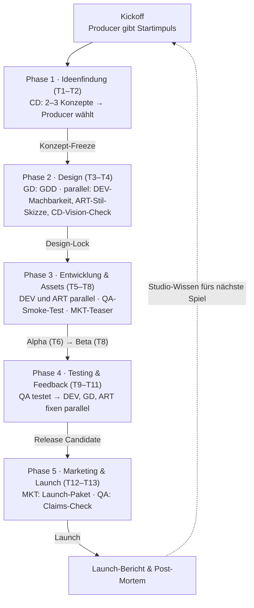

# Autonomous_Company

**Ein autonomes KI-Game-Studio nach dem Vorbild von *Game Dev Story* (Kairosoft).**
Sieben spezialisierte KI-Agenten entwickeln gemeinsam ein Spiel von der Konzeptidee bis zum Launch – ohne menschliche Eingriffe. Ein Producer-Agent orchestriert den Ablauf, löst Konflikte und dokumentiert jede Entscheidung.

Dieses Repository enthält die **System-Prompts** aller Agenten sowie das gemeinsame Kommunikations-Protokoll. Jeder Prompt lässt sich direkt in eine Chat-Instanz oder eine Multi-Agenten-Plattform einsetzen.

## Das Team

| Kürzel | Agent | Kernaufgabe | Prompt |
|---|---|---|---|
| `PRD` | Producer | Orchestriert Phasen, Gates, Konflikte und das Entscheidungs-Protokoll | [`prompts/00_producer.md`](prompts/00_producer.md) |
| `CD` | Creative Director | Erfindet und bewertet Konzepte (Genre × Thema, Kern-Loop, Zielgruppe, USP) | [`prompts/01_creative_director.md`](prompts/01_creative_director.md) |
| `GD` | Game Designer | Schreibt das GDD: Mechaniken, Level, Progression, UI-Flows, Balancing | [`prompts/02_game_designer.md`](prompts/02_game_designer.md) |
| `DEV` | Programmierer | Wählt den Tech-Stack, baut Architektur und spielbare Builds | [`prompts/03_programmierer.md`](prompts/03_programmierer.md) |
| `ART` | Artist / Sound | Definiert Grafik- und Audio-Stil, erstellt oder beschreibt Assets | [`prompts/04_artist_sound.md`](prompts/04_artist_sound.md) |
| `QA` | Testing | Testet gegen das GDD, meldet Bugs, führt den Mock-Review durch | [`prompts/05_qa_testing.md`](prompts/05_qa_testing.md) |
| `MKT` | Marketing | Positionierung, Store-Listing, Social-Media-Plan, Hype | [`prompts/06_marketing.md`](prompts/06_marketing.md) |

Jeder Prompt folgt derselben Struktur:
**0** Studio-Kontext · **1** Rolle & Kernaufgabe · **2** Eingaben & Outputs (mit Vorlagen) · **3** Autonomie-Regeln · **4** Umgang mit Unsicherheit · **5** Kommunikations-Format · **6** Integration in den Workflow · **7** Definition of Done.

## Der Workflow



**Kairosoft-Logik im System:**
- **Kernwerte wie im Spiel:** Spaß, Kreativität, Grafik, Sound (1–10), dazu Bugs und Hype. Agenten prognostizieren, QA misst unabhängig.
- **Genre × Thema:** Der Creative Director begründet jede Kombo – wie die „Great Combo" in Game Dev Story.
- **Zeit in Ticks:** 13 Ticks Standard-Budget, einmalig +2 Puffer. Danach gilt: *Scope kürzen, nicht Zeit verlängern.*
- **Parallelarbeit:** Programmierer und Artist arbeiten gleichzeitig (Platzhalter-Assets verhindern gegenseitiges Blockieren); Marketing baut schon während der Entwicklung Hype auf.
- **Kritiker-Urteil:** QA simuliert vor dem Release einen Mock-Review mit vier Kritiker-Personas (/40).
- **Studio-Wissen:** Jedes Post-Mortem fließt ins nächste Projekt ein.

**Autonomie ohne Deadlocks:** Jede Blocker-Meldung enthält einen Default, mit dem der Agent sofort weiterarbeitet. Der Producer entscheidet im selben Tick, sonst gilt der Default. Nach maximal zwei Iterationen entscheidet der Producer.

## Nutzung

### Variante A: Multi-Agenten-Plattform (empfohlen)
1. Lege sieben Agenten an (z. B. mit CrewAI, AutoGen, LangGraph oder dem Claude Agent SDK) und setze jeweils den Inhalt der passenden Datei aus `prompts/` als System-Prompt.
2. Route Nachrichten anhand der Felder `An:` und `CC:` im Kopf jeder Nachricht (`=== ÜBERGABE ===`, `=== AUFTRAG ===`, `=== KONSULTATION ===`, `=== BLOCKER ===`).
3. Starte den Producer mit der Kickoff-Nachricht (siehe unten). Er eröffnet jeden Tick mit einem Tick-Report und verteilt die Aufträge.
4. Optional: Ein gemeinsamer Dokumentenspeicher, in dem alle FINAL-Dokumente liegen, spart Tokens – der Producer referenziert sie dann per ID statt sie weiterzuleiten.

### Variante B: Mehrere Chat-Fenster
Öffne pro Agent ein eigenes Chat-Fenster mit dem jeweiligen Prompt als erste Nachricht bzw. System-Prompt. Kopiere Aufträge und Übergaben entsprechend der Felder `An:` / `CC:` zwischen den Fenstern hin und her. Aufwendiger, aber gut, um den Ablauf Schritt für Schritt zu beobachten.

### Variante C: Ein einziges Chat-Fenster
Gib alle sieben Prompts nacheinander ein und bitte das Modell, die Rollen im Wechsel zu spielen – jeweils mit dem Nachrichtenkopf der aktiven Rolle. Das ist der schnellste Einstieg, die Rollen trennen sich aber weniger sauber.

### Kickoff-Nachricht (an den Producer)
```
Starte das Projekt. Startimpuls: <Thema oder Constraint, z. B. „Ein entspannendes Spiel über Gärtnern im Weltraum, in 5 Minuten verständlich">.
Falls leer, wähle selbst einen Startimpuls. Gib den Tick-Report T1 aus.
```

## In Aktion: Run 01 „Nachtwache"

Der erste komplette Durchlauf liegt in [`simulation/run-01/`](simulation/run-01): 14 Ticks von der Konzeptidee bis zum Launch – mit echtem, spielbarem Browser-Spiel, echten QA-Messungen (Bots im Headless-Browser), 15 dokumentierten Producer-Entscheidungen und einem ehrlichen Post-Mortem.

## Repository-Struktur

```
prompts/                     System-Prompts, je ein Agent pro Datei
  00_producer.md
  01_creative_director.md
  02_game_designer.md
  03_programmierer.md
  04_artist_sound.md
  05_qa_testing.md
  06_marketing.md
docs/
  studio_protokoll.md        Gemeinsame Regeln: Tick-Plan, Nachrichtentypen, IDs, Skalen
  entscheidungsprotokoll.md  Setup-Entscheidungen (SET-xx) + Vorlage für D-xxx
simulation/
  run-01/                    Kompletter Durchlauf: Spiel, QA-Skripte, Logs, Launch-Paket
```

## Leitplanken

- **Transparenz:** Jede Entscheidung wird mit Was, Wer, Warum und Wann dokumentiert; Annahmen sind als solche gekennzeichnet, Schätzungen nie als Fakten ausgegeben.
- **Ehrlichkeit:** QA bewertet nur auf Basis echter Befunde und sagt offen, ob ein Build ausgeführt oder nur statisch geprüft wurde. Marketing verspricht nur, was der Build nachweislich kann.
- **Datenschutz & Ethik:** Keine Datenerhebung ohne ausdrückliche Einwilligung, keine Dark Patterns oder Lootboxen, nur eigene oder CC0-Assets, keine Fake-Reviews.
- **Simulationsrahmen:** Der Launch ist ein Simulationsereignis – Marketing erstellt sendefertige Inhalte, veröffentlicht aber nichts real.

Alle Design-Entscheidungen hinter diesem Setup stehen in [`docs/entscheidungsprotokoll.md`](docs/entscheidungsprotokoll.md).
