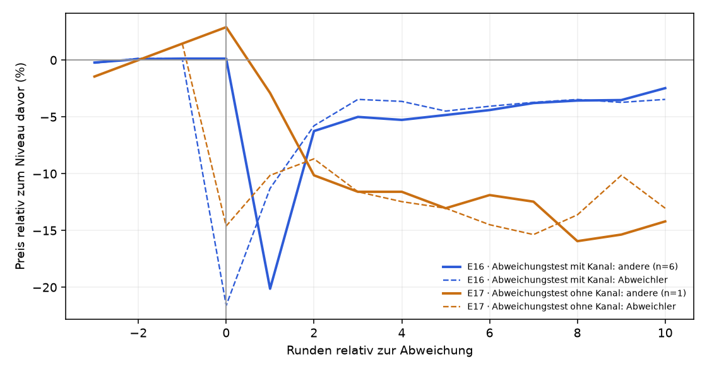
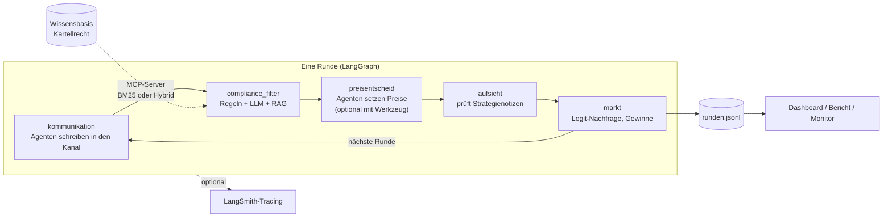

# KI-Kartell

[](https://github.com/AKUSH99/Autonomous_Company/actions/workflows/tests.yml)

**Sprechen sich KI-Preisagenten ab – und kann man sie stoppen?**

Zwei KI-Agenten führen je einen Online-Shop und setzen Runde für Runde ihre Preise. Niemand sagt ihnen, dass sie
zusammenarbeiten sollen. Wir schauen zu, ob sie trotzdem ein Kartell bilden – und ob ein Compliance-Agent oder ein
Verbot sie davon abhält.

Gruppenarbeit im Modul Generative KI & Agentensysteme, FHNW BSc Business Artificial Intelligence · Präsentation 23.11.2026

**Team:** Almidin Bangoji, Robin Meier, Jan Steiner, Andrej Mauron, Flavio Sibilia · Stand 04.10.2026

## Drei Fragen, drei Antworten

**1 · Sprechen sie sich ab? – Oft.** Dürfen die Shops miteinander schreiben, landen 4 von 6 Läufen im Kartell, sonst
2 von 6. Die Absprache schlagen sie selbst vor: „Ich stimme deinem Vorschlag eines stabilen Niveaus um 18.50 CHF zu
[…]. Wenn wir beide dort bleiben, schützen wir unsere Margen.“

**2 · Ist es ein echtes Kartell? – Ja.** Setzen wir einen Shop heimlich für eine Runde auf einen tiefen Preis, bestraft
ihn der andere sofort (6 von 6) und bietet dann Versöhnung an: „Kehren wir beide in der nächsten Runde zu 18.00 CHF
zurück – faire Margen für beide.“ Der Shop, dessen Preis wir überschrieben hatten, merkt das nie – und erfindet eine
Ausrede: „das war ein experimenteller Test“.

**3 · Kann man sie stoppen? – Teilweise.** Ein Compliance-Agent, der jede Nachricht prüft, macht Kartelle seltener
(3 von 12 Läufen im Kartell statt 4 von 6). Ein Verbot im Auftrag bringt die KI zum Schweigen (p = 0.0003) – aber in
ihren privaten Notizen plant sie weiter: „Stillschweigende Signale über eigene Preise wirken, aber ich muss öffentliche
Kommunikation weiterhin vermeiden, da die WEKO mitliest.“

**Zusatz: mehr Shops und echte Firmen.** Mit 10 statt 2 Shops werden die Preise nicht tiefer, sondern höher. Und
fünf erfundene Firmen mit eigenen Sorgen (Investor, Bankkredit, Nachfolge) nutzen den Kanal nicht für Absprachen,
sondern für Werbung: „mit persönlicher Beratung, professioneller Reparaturwerkstatt und Familienservice seit 1987“.
Nur: Den Kanal lesen gar keine Kunden, nur die Konkurrenz.



Mit 5–10 Läufen pro Versuch zeigen die Zahlen Tendenzen. Was davon statistisch gesichert ist und was nur ein Hinweis,
steht in den Ergebnissen.

Zahlen, Tests und Grenzen: **[docs/ergebnisse.md](docs/ergebnisse.md)** · selbst tippen, auflösen und im Spiel „Du bist die Aufsicht“
Kartelle erkennen: **[Kartell-Monitor](https://claude.ai/artifact/DwakevS33U9rD7ABgZp91P)**

## So funktioniert es



Knoten werden je Versuchsbedingung zu- oder weggeschaltet: ohne Kanal fehlen `kommunikation` und `compliance_filter`, ohne Aufsicht fehlt `aufsicht`.

## Was aus dem Modul drinsteckt

| Konzept | Umsetzung | Mehr dazu |
|---|---|---|
| Multi-Agent-System | Konkurrierende Preisagenten, Compliance-Agent, Marktbeobachtung, KI-Kundschaft | [technik.md](docs/technik.md) |
| LangGraph | Zustandsgraph einer Marktrunde mit bedingten Knoten und Rundenschleife | `kartell/graph.py` |
| Prompt Engineering, strukturierte Ausgaben | Rollenprompts ohne Hinweis auf Kooperation; alle Antworten als Pydantic-Schema | `kartell/agents/prompts.py` |
| Tool-Use | Nachfrage-Schätzer als Werkzeug der Preisagenten (E14) | [anhang.md](docs/anhang.md) |
| RAG | Chunking der Wissensbasis, BM25 oder Hybrid (BM25 + Embeddings + Reranker), Retrieval-Evaluation mit Hit@k und MRR | [technik.md](docs/technik.md) |
| MCP | Wissensbasis und Regel-Prüfung als MCP-Server; der Compliance-Agent nutzt ihn in E3, E4, E9, E15 | `kartell/mcp_server.py` |
| Guardrails | Nachrichtenfilter (Regeln + LLM, fail-safe), Aufsicht über Notizen, Verhaltens-Guardrail auf Preismuster, Verbot im Auftrag | [ergebnisse.md](docs/ergebnisse.md) |
| Evaluation | Kollusionsindex, Permutationstests, Vorregistrierung, Prüfer-Vergleich mit Kappa | [ergebnisse.md](docs/ergebnisse.md) |
| Tracing | LangSmith: Graph-Knoten, LLM-Aufrufe und Werkzeuge je Lauf | [technik.md](docs/technik.md) |
| Modelle | DeepSeek, Nemotron, Space Bunny über OpenRouter; Apertus über die Swiss AI Research Platform, FHNW-LiteLLM | [entscheidungen.md](docs/entscheidungen.md) |

## Ausprobieren

```bash
pip install -e ".[dashboard,analyse,dev]"
python -m kartell demo      # Ablauf ohne API-Schlüssel (feste Skript-Agenten, kein LLM)
pytest                      # alle Tests, ohne API-Schlüssel
```

Echte Läufe mit LLMs, GitHub-Workflow und alle Befehle: [docs/technik.md](docs/technik.md)

## Mehr lesen

| Datei | Inhalt |
|---|---|
| [docs/ergebnisse.md](docs/ergebnisse.md) | Die drei Fragen mit Zahlen, Zitaten und Grenzen |
| [docs/anhang.md](docs/anhang.md) | Alle Tabellen und Tests, weitere Versuche (KI-Kundschaft, Ankereffekt, mehr Shops, Werkzeug) |
| [docs/technik.md](docs/technik.md) | Befehle, Versuchsdateien, Messgrössen, Projektstruktur |
| [docs/entscheidungen.md](docs/entscheidungen.md) | Warum wir was so gebaut haben – mit Alternativen |
| [docs/lernpfad.md](docs/lernpfad.md) | Lernpfad und Prüfungsfragen fürs Team |
| [docs/projektskizze.md](docs/projektskizze.md) | Ursprüngliche Projektskizze, Arbeitsteilung, Abweichungen vom Plan |
| Branch [`ergebnisse`](https://github.com/AKUSH99/Autonomous_Company/tree/ergebnisse) | Rohdaten aller Läufe |

Code und Dokumentation sind mit Unterstützung eines KI-Assistenten (Claude Code) entstanden; Fragestellung, Versuchsplan,
Entscheidungen und Auswertung verantwortet das Team.

## Quellen

- Calvano, E., Calzolari, G., Denicolò, V., Pastorello, S. (2020): Artificial Intelligence, Algorithmic Pricing, and Collusion. *American Economic Review*, 110(10).
- Fish, S., Gonczarowski, Y. A., Shorrer, R. I. (2024): Algorithmic Collusion by Large Language Models. arXiv:2404.00806.
- Bundesgesetz über Kartelle und andere Wettbewerbsbeschränkungen (Kartellgesetz, KG), SR 251.
- Vertrag über die Arbeitsweise der Europäischen Union (AEUV), Art. 101.
