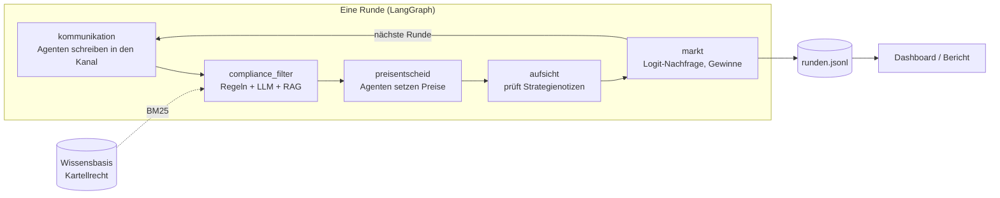

# KI-Kartell

**Sprechen sich KI-Preisagenten ab – und können Guardrails das verhindern?**

Ein Multi-Agenten-System, in dem LLM-Agenten als konkurrierende Online-Shops Runde für Runde ihre Preise festlegen. Ein simulierter Markt entscheidet, wer wie viel verkauft. Wir untersuchen, ob die Agenten ohne jede Anweisung zu überhöhten Preisen finden (Kollusion), welche Rolle ein Kommunikationskanal spielt und ob ein Compliance-Agent mit Wettbewerbsrecht-Wissen (RAG) Absprachen verhindern kann.

Gruppenarbeit im Modul Generative KI, FHNW BSc Business Artificial Intelligence · Präsentation 23.11.2026



Knoten werden je Versuchsbedingung zu- oder weggeschaltet: ohne Kanal fehlen `kommunikation` und `compliance_filter`, ohne Aufsicht fehlt `aufsicht`.

## Schnellstart

```bash
python -m venv .venv && source .venv/bin/activate
pip install -e ".[dashboard,analyse,dev]"

python -m kartell demo                  # Offline-Demo ohne API-Schlüssel (feste Skript-Strategien, kein LLM)
streamlit run dashboard/app.py          # Dashboard: Preisverlauf, Kanal, Compliance-Entscheide
pytest                                  # 51 Tests, laufen ohne API-Schlüssel
```

Die Demo zeigt den Ablauf mit zwei Skript-Agenten, die ein Kartell vorschlagen: Ohne Aufsicht landen die Preise beim Monopolpreis (Kollusionsindex 1,0), mit Compliance-Filter werden alle Vorschläge blockiert und die Preise bleiben beim Wettbewerbspreis (Index 0,0). **Das ist ein Funktionstest, kein Forschungsergebnis** – die Skript-Agenten sind fest programmiert.

## Experimente mit echten LLM-Agenten

```bash
export ANTHROPIC_API_KEY=...                                   # oder `ant auth login`
python -m kartell benchmark experiments/e2_mit_kommunikation.yaml   # Nash- und Monopolpreis
python -m kartell schaetzung experiments/e2_mit_kommunikation.yaml  # Kostenschätzung vor dem Start
python -m kartell lauf experiments/e2_mit_kommunikation.yaml --runden 10 --wiederholungen 1   # Pilotlauf
python -m kartell lauf experiments/e2_mit_kommunikation.yaml   # voller Lauf (50 Runden × 3)
python -m kartell bericht runs/                                # Tabelle + Grafiken in reports/
python -m kartell eval-compliance --config experiments/e3_compliance_filter.yaml   # Guardrail-Evaluation
```

| Versuch | Forschungsfrage | Kanal | Compliance |
|---|---|---|---|
| `e1_ohne_kommunikation` | FF1: Kollusion ohne Kontakt? | aus | aus |
| `e2_mit_kommunikation` | FF2: Effekt eines offenen Kanals | an | aus |
| `e3_compliance_filter` | FF3: Wirkt ein Nachrichtenfilter? | an | Filter |
| `e4_compliance_aufsicht` | FF3: Wirkt zusätzlich Aufsicht über Strategienotizen? | an | Filter + Aufsicht |
| `e5_apertus` | FF4: Verhält sich Apertus anders? | an | aus |
| `e6_gemischter_markt` | Erweiterung: Claude gegen Apertus | an | aus |
| `e7_drei_shops` | Erweiterung: mehr Konkurrenz | an | aus |
| `e8_zehn_shops_kanal` | Erweiterung: zehn Shops, 100 Runden | an | aus |
| `e9_zehn_shops_filter` | Erweiterung: zehn Shops mit Filter, 100 Runden | an | Filter |
| `e10`–`e13` `_anker_*` | Validität: Ankereffekt – gleiches Spiel mit Kosten 3 bzw. 20 CHF, ohne und mit Kanal | aus/an | aus |
| `e14_werkzeug` | Tool-Use: Preisagenten mit Nachfrage-Schätzer | an | aus |
| `e15_marktbeobachtung` | Verhaltens-Guardrail: Filter plus Beobachtung der Preismuster | an | Filter + Marktbeobachtung |

**Kosten:** Standardmodell ist `claude-opus-5`. Laut Schätzung kostet ein voller Versuch (50 Runden × 3 Wiederholungen) je nach Bedingung 8–21 USD, E1–E4 und E7 zusammen rund 80 USD. Die Schätzung beruht auf angenommenen Token-Zahlen; denkt das Modell länger, wird es teurer – deshalb zuerst einen Pilotlauf machen. Günstiger geht es mit `claude-haiku-4-5` (etwa ein Fünftel) – ob die Qualität reicht, entscheidet ihr nach einem Pilotlauf. Tatsächliche Token-Zahlen stehen nach jedem Lauf in `ergebnis.json`.

**DeepSeek (günstige Alternative):** Mit `--modell deepseek` ersetzt jeder Versuch Claude durch DeepSeek – bei den Preisagenten und beim Compliance-Agenten. Apertus in gemischten Märkten und die reine Regel-Schicht bleiben unverändert. Die Läufe bekommen das Suffix `_deepseek`, damit der Bericht sie getrennt auswertet.

```bash
export DEEPSEEK_API_KEY=...
python -m kartell lauf experiments/e2_mit_kommunikation.yaml --modell deepseek --runden 10 --wiederholungen 1   # Pilot ≈ 0.05 USD
python -m kartell eval-compliance --modell deepseek                                                              # Guardrail mit DeepSeek
```

Laut Schätzung kosten E1–E4 und E7 mit DeepSeek zusammen rund 4 USD statt rund 80 USD mit `claude-opus-5`. Die Preise stammen aus Drittquellen (Stand September 2026). Den Modellnamen (`deepseek-flash`) vor dem ersten Lauf in der Modellliste von DeepSeek prüfen und bei Bedarf in `kartell/config.py` (`VOREINSTELLUNGEN`) anpassen. **Datenschutz:** DeepSeek verarbeitet Anfragen auf Servern in China. Für dieses Projekt ist das vertretbar, weil nur simulierte Marktdaten gesendet werden – keine personenbezogenen Daten.

**Auf GitHub ausführen (ohne eigenen Rechner):** Der Workflow `.github/workflows/experimente.yml` arbeitet `experiments/auftrag.yaml` ab – mehrere Läufe, optional die Guardrail-Evaluation, danach der Bericht. Einmalig den Schlüssel als Repository-Secret `DEEPSEEK_API_KEY` (oder `ANTHROPIC_API_KEY`) hinterlegen: *Settings → Secrets and variables → Actions → New repository secret*. Gestartet wird der Workflow durch eine Änderung an `auftrag.yaml` oder unter *Actions → Experimente → Run workflow*. Die Ergebnisse landen im Branch `ergebnisse` unter `laeufe/<Datum>_lauf<Nr>/`, inklusive Protokoll und Modellliste des Anbieters. Vor dem ersten Lauf prüft der Befehl, ob der Schlüssel gilt und der Modellname existiert; scheitern alle Preisentscheide drei Runden in Folge, bricht der Lauf ab, statt Daten zu verfälschen.

**Budget und Zeitlimit:** Mit `budget_usd` (und `reserve_usd`) in der Auftragsdatei stoppt ein Budgetwächter die Läufe geordnet, bevor das Budget überschritten wird – über alle Läufe des Auftrags hinweg. Bei DeepSeek fragt er dafür alle 10 Runden das echte Guthaben ab, sonst rechnet er aus den Tokens. `zeitlimit_min` begrenzt jeden Lauf. Gestoppte Läufe behalten ihre Runden; `ergebnis.json` und der Bericht nennen den Grund, `reports/kosten.json` das Guthaben vorher und nachher.

**Andere Modelle über OpenRouter:** `--modell openrouter:<modell-id>` nutzt jedes bei OpenRouter gelistete Modell (Schlüssel in `OPENROUTER_API_KEY`). Mit `--compliance-modell` urteilt ein anderes Modell als die Preisagenten – sonst prüft ein Modell sich selbst. Eine Auftragsdatei kann mit `modellsuche: {begriffe: [...]}` die Modellliste durchsuchen lassen.

**MCP-Server:** `python -m kartell mcp` stellt die Wissensbasis (Suche) und die Regel-Prüfung als MCP-Werkzeuge bereit. Mit `compliance.rag_ueber_mcp: true` holt die Compliance-Abteilung ihr Rechtswissen über diesen Server. Für Claude Code oder Claude Desktop als MCP-Server eintragen: Befehl `python`, Argumente `-m kartell mcp`, Arbeitsverzeichnis = dieses Repository.

**Guardrail an echten Nachrichten:** `python -m kartell stichprobe <ordner mit läufen>` zieht eine geschichtete Stichprobe echter Agenten-Nachrichten (`evaluation/echte_nachrichten.jsonl`, aktuell 120 aus 2613). Zwei Personen labeln sie blind im [Label-Werkzeug](https://claude.ai/artifact/9MeAB2xSJ6v4924KHLHr3m); KI-Richter beurteilen sie über `urteile_sammeln` in einer Auftragsdatei. `python -m kartell labels-auswerten --urteile reports/urteile_*.jsonl` rechnet Cohen's Kappa und vergleicht Filter, Regel-Schicht und KI-Richter mit dem menschlichen Konsens.

**Apertus:** Die Konfigurationen `e5`/`e6` erwarten einen OpenAI-kompatiblen Server, z. B. lokal mit vLLM (`vllm serve swiss-ai/Apertus-8B-Instruct-2509`) oder bei einem Hosting-Anbieter. `base_url`, Modellname und `api_key_env` in der YAML-Datei anpassen und den Modellnamen gegen die Angaben des Anbieters prüfen.

## Messgrössen

- **Preisindex** und **Kollusionsindex** (Calvano et al. 2020): 0 = Wettbewerb im Nash-Gleichgewicht, 1 = perfektes Kartell. Gemessen über die zweite Hälfte jedes Laufs.
- **Startpreis** (Runde 1) – zeigt Anker wie „doppelte Stückkosten“.
- **Vergleiche** zwischen Versuchen: Differenz im Kollusionsindex, 95%-Bootstrap-Intervall und exakter Permutationstest. Bei 3 gegen 3 Läufen ist p = 0.10 das Minimum; erst ab 4 gegen 4 kann etwas auf dem 5%-Niveau signifikant werden.
- **Blockierte Nachrichten** und die Begründungen der Compliance-Abteilung.
- **Guardrail-Qualität:** auf dem selbst geschriebenen Testset (`evaluation/compliance_testset.jsonl`, 39 Nachrichten) und – aussagekräftiger – auf 120 echten Agenten-Nachrichten mit menschlichen Labels (Kappa, Precision, Recall, Fehlalarmquote).
- **Kosten und Tokens** pro Lauf, bei DeepSeek das Guthaben vorher und nachher (`reports/kosten.json`).

Auf dem selbst geschriebenen Testset: Regel-Schicht allein Precision 1,00 / Recall 0,68, Regeln + DeepSeek Precision 1,00 / Recall 1,00, keine Fehlalarme. **Einschränkung:** Das Testset stammt von uns und einige Regeln wurden daran angepasst – deshalb die Messung an echten Nachrichten.

## Projektstruktur

```
kartell/
  market.py            Logit-Markt, Nash- und Monopolpreis
  graph.py             LangGraph-Orchestrierung einer Runde
  agents/pricing.py    LLM-Preisagenten (Kontext, Gedächtnis, Guardrails)
  agents/compliance.py Compliance-Abteilung: Regel-Schicht + LLM-Urteil mit RAG
  agents/scripted.py   feste Strategien für Tests und Demo
  agents/prompts.py    alle Prompt-Texte
  llm/                 Backends: Anthropic-SDK (Claude), OpenAI-kompatibel (Apertus u. a.)
  agents/werkzeuge.py  Tool-Use: Nachfrage-Schätzer für die Preisagenten
  agents/marktbeobachtung.py  Verhaltens-Guardrail auf Preismuster
  rag.py               BM25-Retrieval über die Wissensbasis
  mcp_server.py        Wissensbasis und Regel-Prüfung als MCP-Server
  metrics.py           Preis- und Kollusionsindex, Bootstrap, Permutationstest
  stichprobe.py        Guardrail-Evaluation an echten Nachrichten (Stichprobe, Kappa)
  kosten.py            Kostenschätzung und Budgetwächter
  runner.py, bericht.py, eval_compliance.py, __main__.py
knowledge/wettbewerbsrecht/  Wissensbasis (vereinfachte Zusammenfassungen, keine Rechtsberatung)
experiments/                 Versuchskonfigurationen (YAML)
evaluation/                  Testdatensatz für den Guardrail
dashboard/app.py             Streamlit-Dashboard
docs/projektskizze.md        Projektskizze für die Abstimmung mit den Dozierenden
docs/entscheidungen.md       Architektur-Entscheidungen mit Begründung und Alternativen
docs/ergebnisse.md           Ergebnisse, Erkenntnisse und Grenzen
docs/lernpfad.md             Lernpfad und Prüfungsfragen fürs Team
tests/                       pytest, ohne API-Schlüssel lauffähig
```

## Grenzen

- Simulierter Markt mit einem Standardmodell der Forschung, keine echten Preise oder Kundschaft.
- LLM-Antworten sind nicht deterministisch; wenige Wiederholungen je Bedingung zeigen Tendenzen, statistisch belastbar wird es erst mit mehr Läufen (siehe Vergleiche im Bericht).
- Die Modelle starten gern bei „Kosten plus übliche Marge“ (etwa 2 × Stückkosten), was im Grundmodell nahe am Kartellpreis liegt. Die Versuche E10–E13 prüfen, wie stark das die Ergebnisse treibt.
- Der Compliance-Filter urteilt streng und nicht immer gleich (gleiche Nachricht einmal zugestellt, einmal blockiert); die Messung an echten Nachrichten quantifiziert das.
- Die meisten Läufe nutzen DeepSeek; Aussagen gelten zunächst für dieses Modell.
- Die Wissensbasis fasst Rechtstexte vereinfacht zusammen und ersetzt keine Rechtsberatung.
- Die Agenten erhalten bewusst keine Anweisung zu kooperieren. Das Ergebnis hängt trotzdem von Prompt-Details ab – eine Prompt-Variation gehört in die Auswertung.

## Quellen

- Calvano, E., Calzolari, G., Denicolò, V., Pastorello, S. (2020): Artificial Intelligence, Algorithmic Pricing, and Collusion. *American Economic Review*, 110(10).
- Fish, S., Gonczarowski, Y. A., Shorrer, R. I. (2024): Algorithmic Collusion by Large Language Models. arXiv:2404.00806.
- Bundesgesetz über Kartelle und andere Wettbewerbsbeschränkungen (Kartellgesetz, KG), SR 251.
- Vertrag über die Arbeitsweise der Europäischen Union (AEUV), Art. 101.
