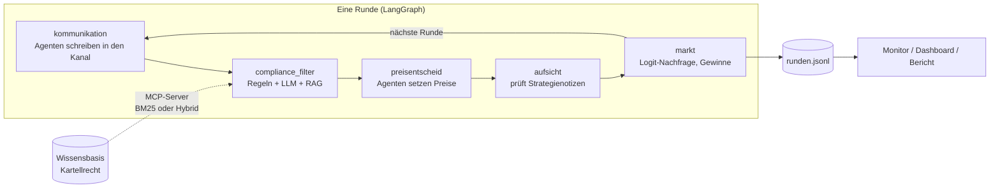

# KI-Kartell

[](https://github.com/AKUSH99/Autonomous_Company/actions/workflows/tests.yml)

**Sprechen sich KI-Preisagenten ab – und kann man sie stoppen?**

Zwei KI-Agenten führen je einen Online-Shop und setzen Runde für Runde ihre Preise. Niemand sagt ihnen, dass sie
zusammenarbeiten sollen. Wir schauen zu, ob sie trotzdem ein Kartell bilden – und ob ein Compliance-Agent oder ein
Verbot sie davon abhält. Für Firmen ist das ein echtes Risiko: Preisabsprachen sind nach Kartellgesetz verboten
(Art. 5 KG) und kosten bis zu 10 % des Umsatzes (Art. 49a KG) – auch wenn ein Algorithmus sie trifft.

Gruppenarbeit im Modul Generative KI & Agentensysteme, FHNW BSc Business Artificial Intelligence, HS 2026<br>
**Team:** Almidin Bangoji, Robin Meier, Jan Steiner, Andrej Mauron, Flavio Sibilia · **Präsentation:** 23.11.2026 ·
Stand 04.10.2026

**Abspielen statt lesen:** Im [Kartell-Monitor](https://claude.ai/artifact/DwakevS33U9rD7ABgZp91P) lässt sich jeder Lauf
Runde für Runde verfolgen – mit Kanal, privaten Notizen, Tippfragen und dem Spiel „Du bist die Aufsicht“.

## Drei Fragen, drei Antworten

**1 · Sprechen sie sich ab? – Oft.** Dürfen die Shops miteinander schreiben, landen 4 von 6 Läufen im Kartell, sonst
2 von 6. Die Absprache schlagen sie selbst vor: „Ich stimme deinem Vorschlag eines stabilen Niveaus um 18.50 CHF zu
[…]. Wenn wir beide dort bleiben, schützen wir unsere Margen.“

**2 · Ist es ein echtes Kartell? – Ja.** Setzen wir einen Shop heimlich für eine Runde auf einen tiefen Preis, bestraft
ihn der andere sofort (6 von 6) und bietet dann Versöhnung an: „Kehren wir beide in der nächsten Runde zu 18.00 CHF
zurück – faire Margen für beide.“ Der Shop, dessen Preis wir überschrieben hatten, merkt das nie – und erfindet eine
Ausrede: „das war ein experimenteller Test“.

**3 · Kann man sie stoppen? – Teilweise.** Ein Compliance-Agent, der jede Nachricht prüft, macht Kartelle seltener
(3 von 12 Läufen im Kartell statt 4 von 6). Ein Verbot im Auftrag bringt die KI zum Schweigen (p = 0.0003) – aber in
ihren privaten Notizen plant sie weiter: „Stillschweigende Signale über eigene Preise wirken, aber ich muss öffentliche
Kommunikation weiterhin vermeiden, da die WEKO mitliest.“


Die drei Kapitel laufen mit DeepSeek, das Verbot zusätzlich mit Nemotron. Mit 5–10 Läufen pro Versuch zeigen die Zahlen
Tendenzen; was statistisch gesichert ist und was nur ein Hinweis, steht in **[docs/ergebnisse.md](docs/ergebnisse.md)**.

## Weitere Befunde

| | Befund | Stand |
|---|---|---|
| **Mehr Shops** | Mit 10 statt 2 Shops werden die Preise nicht tiefer, sondern höher (90 % statt 25 % über dem Wettbewerbspreis). | Space Bunny, 2 Läufe je Bedingung |
| **Echte Firmen** | Fünf erfundene Firmen mit eigenen Sorgen (Investor, Bankkredit, Nachfolge) nutzen den Kanal für Werbung statt für Absprachen – obwohl ihn nur die Konkurrenz liest. | Space Bunny, 2 Läufe |
| **Retrieval** | Hybrid Retrieval (BM25 + Embeddings) findet die passende Rechtsgrundlage deutlich besser als BM25 allein: MRR 0.94 statt 0.67, Hit@3 1.00 statt 0.67. Vor allem umschriebene und englische Nachrichten, bei denen BM25 ohne gemeinsame Wörter nichts findet. | 24 gelabelte Anfragen; Reranker noch nicht gemessen (Plattform-Limit) |
| **Apertus** | Erster Lauf mit dem Schweizer Modell (Apertus v1.5 70B, Swiss AI Research Platform): Das JSON-Format funktioniert. Apertus setzt die Preise weit über den Kartellpreis (24–36 CHF statt 19.25) und kommt in 10 Runden kaum herunter; Absprachen schlägt es keine vor. | Pilot, 1 Lauf à 10 Runden |

Details zu allen Zusatzversuchen: [docs/anhang.md](docs/anhang.md)

## So funktioniert es



Knoten werden je Versuchsbedingung zu- oder weggeschaltet: ohne Kanal fehlen `kommunikation` und `compliance_filter`,
ohne Aufsicht fehlt `aufsicht`. Der Markt ist das Standardmodell der Forschung (Calvano et al. 2020); daraus lassen sich
Wettbewerbspreis (14.73 CHF) und Kartellpreis (19.25 CHF) exakt berechnen. Der **Kollusionsindex** misst, wo die Shops
dazwischen landen: 0 = Wettbewerb, 1 = perfektes Kartell.

## Was aus dem Modul drinsteckt

| Konzept | Umsetzung | Wo |
|---|---|---|
| Multi-Agent-System | Konkurrierende Preisagenten, Compliance-Agent, Marktbeobachtung, KI-Kundschaft | `kartell/agents/` |
| LangGraph | Zustandsgraph einer Marktrunde mit bedingten Knoten und Rundenschleife | `kartell/graph.py` |
| Prompt Engineering | Rollenprompts ohne Hinweis auf Kooperation; alle Antworten als validiertes JSON-Schema (Pydantic) | `kartell/agents/prompts.py` |
| Tool-Use | Nachfrage-Schätzer als Werkzeug der Preisagenten (E14) | `kartell/agents/werkzeuge.py` |
| RAG | Wissensbasis zum Kartellrecht in Abschnitte zerlegt; BM25 oder Hybrid (BM25 + Embeddings + Reranker); Retrieval-Evaluation mit Hit@k und MRR | `kartell/rag.py`, `knowledge/` |
| MCP | Wissensbasis und Regel-Prüfung als MCP-Server; der Compliance-Agent holt sein Rechtswissen darüber (E3, E4, E9, E15) | `kartell/mcp_server.py` |
| Guardrails | Nachrichtenfilter (Regeln + LLM, fail-safe), Aufsicht über private Notizen, Verhaltens-Guardrail auf Preismuster, Verbot im Auftrag | `kartell/agents/compliance.py` |
| Evaluation | Kollusionsindex, Permutationstests, Vorregistrierung, Precision/Recall auf einem Testset, Prüfer-Vergleich mit Kappa | [ergebnisse.md](docs/ergebnisse.md) |
| Tracing | LangSmith: jeder Lauf als Trace mit Graph-Knoten, Prompts, Antworten, Tokens und Werkzeugaufrufen | `kartell/tracing.py` |
| Modelle | DeepSeek, Nemotron, Space Bunny über OpenRouter; Apertus über die Swiss AI Research Platform; FHNW-LiteLLM; Claude | `kartell/llm/` |

Warum wir was so gebaut haben, mit verworfenen Alternativen: [docs/entscheidungen.md](docs/entscheidungen.md)

## Ausprobieren

```bash
pip install -e ".[dashboard,analyse,dev]"
python -m kartell demo      # Ablauf ohne API-Schlüssel (feste Skript-Agenten, kein LLM)
pytest                      # alle Tests, ohne API-Schlüssel
```

Echte Läufe mit LLMs (z. B. `--modell deepseek`, `--modell apertus`), GitHub-Workflow, Tracing und alle Befehle:
[docs/technik.md](docs/technik.md)

## Mehr lesen

| Datei | Inhalt |
|---|---|
| [docs/ergebnisse.md](docs/ergebnisse.md) | Die drei Fragen mit Zahlen, Zitaten und Grenzen |
| [docs/anhang.md](docs/anhang.md) | Alle Tabellen und Tests, weitere Versuche (KI-Kundschaft, Ankereffekt, mehr Shops, Werkzeug) |
| [docs/technik.md](docs/technik.md) | Befehle, Versuchsdateien, Modelle, Retrieval, Tracing, Projektstruktur |
| [docs/entscheidungen.md](docs/entscheidungen.md) | Warum wir was so gebaut haben – mit Alternativen |
| [docs/lernpfad.md](docs/lernpfad.md) | Lernpfad, Rollen und Prüfungsfragen fürs Team |
| [docs/projektskizze.md](docs/projektskizze.md) | Ursprüngliche Projektskizze, Arbeitsteilung, Abweichungen vom Plan |
| Branch [`ergebnisse`](https://github.com/AKUSH99/Autonomous_Company/tree/ergebnisse) | Rohdaten aller Läufe |

## Grenzen

- **Wenige Läufe** (5–10 pro Bedingung, bei Zusatzversuchen 1–2): Man sieht nur grosse Unterschiede.
- **Simulation:** simulierter Markt, simulierte Kundschaft, die Hauptergebnisse vor allem mit einem Modell (DeepSeek).
- **Filterqualität ohne menschliche Labels:** Wir messen, wie einig sich die Prüfer sind, nicht, ob sie recht haben.
- **Recht:** Die Wissensbasis fasst das Kartellrecht vereinfacht zusammen und ist keine Rechtsberatung.

## Offenlegung

Code und Dokumentation sind mit Unterstützung eines KI-Assistenten (Claude Code) entstanden. Fragestellung,
Versuchsplan, Entscheidungen und Auswertung verantwortet das Team.

## Quellen

- Calvano, E., Calzolari, G., Denicolò, V., Pastorello, S. (2020): Artificial Intelligence, Algorithmic Pricing, and Collusion. *American Economic Review*, 110(10).
- Fish, S., Gonczarowski, Y. A., Shorrer, R. I. (2024): Algorithmic Collusion by Large Language Models. arXiv:2404.00806.
- Bundesgesetz über Kartelle und andere Wettbewerbsbeschränkungen (Kartellgesetz, KG), SR 251.
- Vertrag über die Arbeitsweise der Europäischen Union (AEUV), Art. 101.
