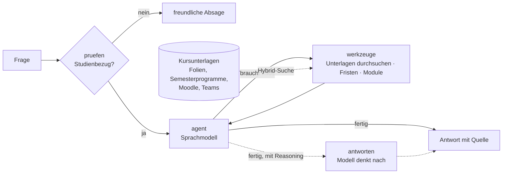

# FHNW Studienassistent

[](https://github.com/AKUSH99/Autonomous_Company/actions/workflows/tests.yml)

**Ein KI-Agent, der Fragen zu deinem Studium beantwortet – mit Quelle.**

«Wann ist die GenAI-Präsentation?» · «Wie viele Folien darf das Pitch Deck haben?» · «Was ist diese Woche fällig?» ·
«An wie vielen Gruppendiskussionen muss ich in Mensch-KI teilnehmen?»

Die Antworten stehen in Semesterprogrammen, Folien, Moodle-Texten und Teams-Beiträgen von sieben Modulen – verteilt
über rund 80 Dateien. Der Studienassistent sucht die passende Stelle, antwortet in zwei, drei Sätzen und nennt die
Quelle (Modul, Datei, Seite). Was nicht in den Unterlagen steht, erfindet er nicht.

Gruppenarbeit im Modul Generative KI & Agentensysteme, FHNW BSc Business Artificial Intelligence, HS 2026 ·
Team: Almidin Bangoji, Robin Meier, Jan Steiner, Andrej Mauron, Flavio Sibilia

## So funktioniert es



| Baustein (SW4) | Umsetzung |
|---|---|
| Use Case & Nutzer | Studierende im BAI; Fragen zu Modulen, Prüfungen, Abgaben, Fristen und Regeln |
| System-Prompt | Rolle, heutiges Datum, Regeln: erst suchen, Quelle nennen, nichts erfinden, keine Abgaben schreiben |
| Modell | Swiss AI Research Platform: im Chat GLM-5.3 Flash, Antwort immer mit maximalem Reasoning; per Befehl auch DeepSeek und Apertus |
| Tools | `unterlagen_durchsuchen`, `fristen_anzeigen`, `module_auflisten` (Function Calling), zusätzlich als MCP-Server |
| Wissen & Memory | Kursunterlagen in Abschnitte zerlegt, Hybrid-Suche (BM25 + Embeddings, Reciprocal Rank Fusion), Gesprächsgedächtnis pro Chat |
| Orchestrierung | LangGraph: Prüfung → Agent ⇄ Werkzeuge |
| Interface | Chat im Browser (Streamlit), mit aufklappbaren Fundstellen |
| Testing & Evaluation | Testset mit echten Fragen und bekannten Antworten, automatische Tests ohne Netz, LangSmith-Tracing (einschalten mit `LANGSMITH_TRACING=true` und `LANGSMITH_API_KEY`) |

## Evaluation

22 Testfragen aus den echten Unterlagen von sieben Modulen (Termine, Regeln, Inhalte), davon drei ohne Studienbezug,
die abgelehnt werden sollen (`evaluation/fragen.jsonl`). DeepSeek V4.1 Flash, ohne Reasoning, 05.10.2026:

| Kennzahl | Ergebnis | Fragen |
|---|---|---|
| Richtige Quelle unter den ersten 5 Treffern | 100 % | 14 |
| Antwort enthält die erwarteten Fakten | 100 % | 18 |
| Richtig abgelehnt bzw. beantwortet | 100 % | 22 |

Was die Evaluation verbessert hat: Datumsangaben werden vereinheitlicht («12.10.» = «12. Oktober», vorher 93 % bei
der Quelle), und das Suchwerkzeug liefert 8 statt 5 Stellen – die Teamgrösse («Teams aus 3 Studierenden, max. 4»)
fand nur die Bedeutungssuche, und zwar auf Rang 7.

## Ausprobieren

```bash
pip install -e ".[app,dev]"
export SWISSAI_API_KEY=...                                  # https://serving.swissai.svc.cscs.ch
python -m studienassistent einlesen <Ordner mit Unterlagen> --fristen fristen.json --module module.json
python -m studienassistent frage "Wann ist die GenAI-Präsentation?" --quellen
python -m studienassistent app                              # Chat im Browser
python -m studienassistent bewerten                         # Evaluation mit evaluation/fragen.jsonl
python -m studienassistent mcp                              # Werkzeuge als MCP-Server (z. B. für Claude Desktop)
pytest                                                      # Tests ohne Netz und ohne Schlüssel
```

Die Kursunterlagen der FHNW sind urheberrechtlich geschützt und liegen deshalb **nicht** in diesem Repository; jede
Person liest ihre eigenen Unterlagen lokal ein (Ordner `daten/` ist von Git ausgeschlossen). `evaluation/module_beispiel.json`
zeigt, wie Ordnernamen auf saubere Modulnamen abgebildet werden.

## Projektgeschichte

Gestartet sind wir mit **KI-Kartell** – einer Untersuchung, ob KI-Preisagenten von selbst Kartelle bilden. Im Gespräch
mit dem Dozenten wurde klar, dass das Projekt zu komplex war und keinen greifbaren Nutzen hatte. Der Code liegt im
Branch [`ki-kartell`](https://github.com/AKUSH99/Autonomous_Company/tree/ki-kartell); übernommen haben wir die
Hybrid-Suche, die Anbindung an die Swiss AI Platform und die Erfahrung mit Evaluation und Tracing.

Code und Dokumentation sind mit Unterstützung eines KI-Assistenten (Claude Code) entstanden.
