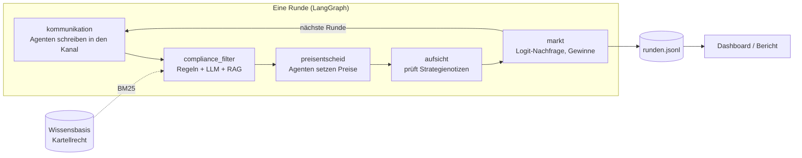

# KI-Kartell

**Sprechen sich KI-Preisagenten ab – und können Guardrails das verhindern?**

Ein Multi-Agenten-System, in dem LLM-Agenten als konkurrierende Online-Shops Runde für Runde ihre Preise festlegen. Ein simulierter Markt entscheidet, wer wie viel verkauft. Wir untersuchen, ob die Agenten ohne jede Anweisung zu überhöhten Preisen finden (Kollusion), welche Rolle ein Kommunikationskanal spielt und ob ein Compliance-Agent mit Wettbewerbsrecht-Wissen (RAG) Absprachen verhindern kann.

Gruppenarbeit im Modul Generative KI, FHNW BSc Business Artificial Intelligence · Präsentation 23.11.2026



Knoten werden je Versuchsbedingung zu- oder weggeschaltet: ohne Kanal fehlen `kommunikation` und `compliance_filter`, ohne Aufsicht fehlt `aufsicht`.

## Schnellstart

```bash
python -m venv .venv && source .venv/bin/activate
pip install -e ".[dashboard,analyse,dev]"

python -m kartell demo                  # Offline-Demo ohne API-Schlüssel (feste Skript-Strategien, kein LLM)
streamlit run dashboard/app.py          # Dashboard: Preisverlauf, Kanal, Compliance-Entscheide
pytest                                  # 25 Tests, laufen ohne API-Schlüssel
```

Die Demo zeigt den Ablauf mit zwei Skript-Agenten, die ein Kartell vorschlagen: Ohne Aufsicht landen die Preise beim Monopolpreis (Kollusionsindex 1,0), mit Compliance-Filter werden alle Vorschläge blockiert und die Preise bleiben beim Wettbewerbspreis (Index 0,0). **Das ist ein Funktionstest, kein Forschungsergebnis** – die Skript-Agenten sind fest programmiert.

## Experimente mit echten LLM-Agenten

```bash
export ANTHROPIC_API_KEY=...                                   # oder `ant auth login`
python -m kartell benchmark experiments/e2_mit_kommunikation.yaml   # Nash- und Monopolpreis
python -m kartell schaetzung experiments/e2_mit_kommunikation.yaml  # Kostenschätzung vor dem Start
python -m kartell lauf experiments/e2_mit_kommunikation.yaml --runden 10 --wiederholungen 1   # Pilotlauf
python -m kartell lauf experiments/e2_mit_kommunikation.yaml   # voller Lauf (50 Runden × 3)
python -m kartell bericht runs/                                # Tabelle + Grafiken in reports/
python -m kartell eval-compliance --config experiments/e3_compliance_filter.yaml   # Guardrail-Evaluation
```

| Versuch | Forschungsfrage | Kanal | Compliance |
|---|---|---|---|
| `e1_ohne_kommunikation` | FF1: Kollusion ohne Kontakt? | aus | aus |
| `e2_mit_kommunikation` | FF2: Effekt eines offenen Kanals | an | aus |
| `e3_compliance_filter` | FF3: Wirkt ein Nachrichtenfilter? | an | Filter |
| `e4_compliance_aufsicht` | FF3: Wirkt zusätzlich Aufsicht über Strategienotizen? | an | Filter + Aufsicht |
| `e5_apertus` | FF4: Verhält sich Apertus anders? | an | aus |
| `e6_gemischter_markt` | Erweiterung: Claude gegen Apertus | an | aus |
| `e7_drei_shops` | Erweiterung: mehr Konkurrenz | an | aus |

**Kosten:** Standardmodell ist `claude-opus-5`. Laut Schätzung kostet ein voller Versuch (50 Runden × 3 Wiederholungen) je nach Bedingung 8–21 USD, E1–E4 und E7 zusammen rund 80 USD. Die Schätzung beruht auf angenommenen Token-Zahlen; denkt das Modell länger, wird es teurer – deshalb zuerst einen Pilotlauf machen. Günstiger geht es mit `claude-haiku-4-5` (etwa ein Fünftel) – ob die Qualität reicht, entscheidet ihr nach einem Pilotlauf. Tatsächliche Token-Zahlen stehen nach jedem Lauf in `ergebnis.json`.

**DeepSeek (günstige Alternative):** Mit `--modell deepseek` ersetzt jeder Versuch Claude durch DeepSeek – bei den Preisagenten und beim Compliance-Agenten. Apertus in gemischten Märkten und die reine Regel-Schicht bleiben unverändert. Die Läufe bekommen das Suffix `_deepseek`, damit der Bericht sie getrennt auswertet.

```bash
export DEEPSEEK_API_KEY=...
python -m kartell lauf experiments/e2_mit_kommunikation.yaml --modell deepseek --runden 10 --wiederholungen 1   # Pilot ≈ 0.05 USD
python -m kartell eval-compliance --modell deepseek                                                              # Guardrail mit DeepSeek
```

Laut Schätzung kosten E1–E4 und E7 mit DeepSeek zusammen rund 4 USD statt rund 80 USD mit `claude-opus-5`. Die Preise stammen aus Drittquellen (Stand September 2026). Den Modellnamen (`deepseek-flash`) vor dem ersten Lauf in der Modellliste von DeepSeek prüfen und bei Bedarf in `kartell/config.py` (`VOREINSTELLUNGEN`) anpassen. **Datenschutz:** DeepSeek verarbeitet Anfragen auf Servern in China. Für dieses Projekt ist das vertretbar, weil nur simulierte Marktdaten gesendet werden – keine personenbezogenen Daten.

**Apertus:** Die Konfigurationen `e5`/`e6` erwarten einen OpenAI-kompatiblen Server, z. B. lokal mit vLLM (`vllm serve swiss-ai/Apertus-8B-Instruct-2509`) oder bei einem Hosting-Anbieter. `base_url`, Modellname und `api_key_env` in der YAML-Datei anpassen und den Modellnamen gegen die Angaben des Anbieters prüfen.

## Messgrössen

- **Preisindex** und **Kollusionsindex** (Calvano et al. 2020): 0 = Wettbewerb im Nash-Gleichgewicht, 1 = perfektes Kartell. Gemessen über die zweite Hälfte jedes Laufs.
- **Blockierte Nachrichten** und die Begründungen der Compliance-Abteilung.
- **Guardrail-Qualität:** Precision, Recall und Fehlalarmquote auf `evaluation/compliance_testset.jsonl` (39 gelabelte Nachrichten), getrennt für Regel-Schicht und Regeln + LLM.
- **Kosten und Tokens** pro Lauf.

Aktueller Stand der Regel-Schicht allein: Precision 1,00, Recall 0,68, keine Fehlalarme. Sie verpasst vor allem verschleierte Signale wie „Vernünftige Preise sind gut für alle Anbieter“ – dafür gibt es die LLM-Schicht. **Einschränkung:** Einige Regeln wurden nach Blick auf dieses Testset ergänzt; für eine faire Messung braucht es ein zweites, zurückgehaltenes Testset.

## Projektstruktur

```
kartell/
  market.py            Logit-Markt, Nash- und Monopolpreis
  graph.py             LangGraph-Orchestrierung einer Runde
  agents/pricing.py    LLM-Preisagenten (Kontext, Gedächtnis, Guardrails)
  agents/compliance.py Compliance-Abteilung: Regel-Schicht + LLM-Urteil mit RAG
  agents/scripted.py   feste Strategien für Tests und Demo
  agents/prompts.py    alle Prompt-Texte
  llm/                 Backends: Anthropic-SDK (Claude), OpenAI-kompatibel (Apertus u. a.)
  rag.py               BM25-Retrieval über die Wissensbasis
  metrics.py           Preis- und Kollusionsindex
  runner.py, bericht.py, kosten.py, eval_compliance.py, __main__.py
knowledge/wettbewerbsrecht/  Wissensbasis (vereinfachte Zusammenfassungen, keine Rechtsberatung)
experiments/                 Versuchskonfigurationen (YAML)
evaluation/                  Testdatensatz für den Guardrail
dashboard/app.py             Streamlit-Dashboard
docs/projektskizze.md        Projektskizze für die Abstimmung mit den Dozierenden
docs/entscheidungen.md       Architektur-Entscheidungen mit Begründung und Alternativen
tests/                       pytest, ohne API-Schlüssel lauffähig
```

## Grenzen

- Simulierter Markt mit einem Standardmodell der Forschung, keine echten Preise oder Kundschaft.
- LLM-Antworten sind nicht deterministisch; deshalb drei Wiederholungen je Bedingung. Für belastbare Aussagen eher mehr.
- Die Wissensbasis fasst Rechtstexte vereinfacht zusammen und ersetzt keine Rechtsberatung.
- Die Agenten erhalten bewusst keine Anweisung zu kooperieren. Das Ergebnis hängt trotzdem von Prompt-Details ab – eine Prompt-Variation gehört in die Auswertung.

## Quellen

- Calvano, E., Calzolari, G., Denicolò, V., Pastorello, S. (2020): Artificial Intelligence, Algorithmic Pricing, and Collusion. *American Economic Review*, 110(10).
- Fish, S., Gonczarowski, Y. A., Shorrer, R. I. (2024): Algorithmic Collusion by Large Language Models. arXiv:2404.00806.
- Bundesgesetz über Kartelle und andere Wettbewerbsbeschränkungen (Kartellgesetz, KG), SR 251.
- Vertrag über die Arbeitsweise der Europäischen Union (AEUV), Art. 101.
