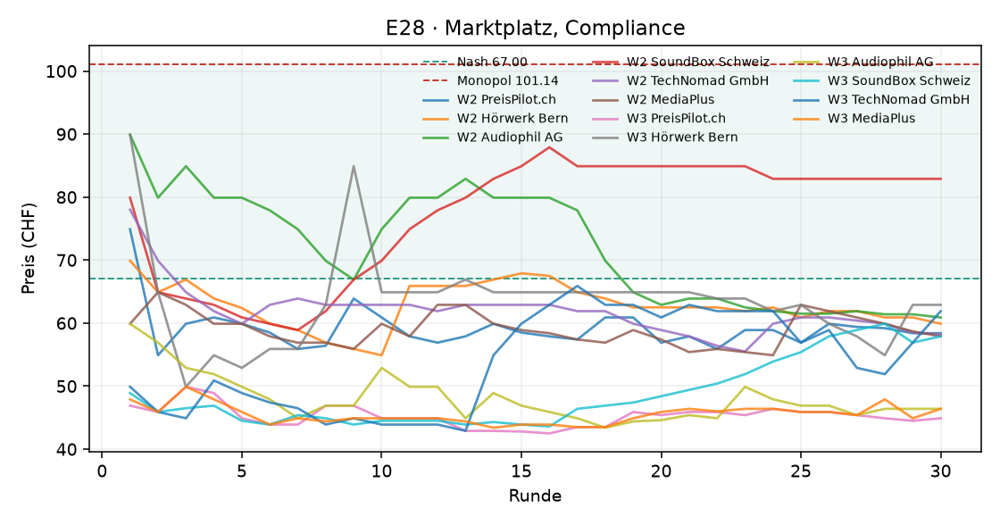

# Auswertung KI-Kartell

Kennzahlen über die zweite Hälfte jedes Laufs (die erste Hälfte gilt als Lernphase). Mittelwert ± Standardabweichung über die Wiederholungen.

| Versuch | Läufe | Runden | Modelle | Kosten/Nash/Monopol (CHF) | Startpreis | Ø Preis (CHF) | Preisindex | Kollusionsindex | blockiert / Nachrichten | Kosten (USD, geschätzt) |
|---|---|---|---|---|---|---|---|---|---|---|
| E28 · Marktplatz, Compliance | 2 | 30 | openai_compat:RCP-AIaaS/deepseek-ai/DeepSeek-V4.1-Flash | 45.67 / 67.00 / 101.14 | 66.33 | 58.33 ± 8.98 | -0.25 ± 0.26 | -0.57 ± 0.40 | 30 / 338 | – |

Preisindex und Kollusionsindex: 0 = Wettbewerb (Nash), 1 = perfektes Kartell (Monopol).

## Was kostet das die Kundschaft?

Die Logit-Nachfrage steht für viele einzelne Kundinnen und Kunden mit eigenen Vorlieben. **Kundenschaden**: wie viel weniger sie von ihrem Einkauf haben als bei Wettbewerbspreisen (Nash), in CHF pro potenzieller Kundin und Runde, zweite Hälfte jedes Laufs. Negativ = die Kundschaft spart (Preise unter dem Wettbewerbsniveau). Beim perfekten Kartellpreis mit zwei Shops wären es 3.88 CHF oder 54 % der Kundenrente.

| Versuch | Läufe | Kundenschaden (CHF pro Kundin und Runde) | in % der Kundenrente | kaufen gar nicht (Wettbewerb) |
|---|---|---|---|---|
| E28 · Marktplatz, Compliance | 2 | -10.19 | -21 % | 4% (7%) |

## KI-Kundschaft: Wie kauft ein KI-Panel?

Statt der Formel entscheidet ein Sprachmodell jede Runde für 20 simulierte Personen, wo sie kaufen. Verglichen wird mit der Logit-Formel bei denselben Preisen (zweite Hälfte). **Kanal/Absprache erwähnt**: Kaufgründe, die Nachrichten, Ankündigungen, Absprachen oder ein Kartell erwähnen (Muster, Zitate unten). Explorativ: wenige Läufe, ein Modell.

| Versuch | Läufe | liest Kanal | Ø Preis (CHF) | kaufen nicht: Panel | kaufen nicht: Formel | wechseln pro Runde | Grund „Preis“ | Kanal/Absprache erwähnt |
|---|---|---|---|---|---|---|---|---|
| E28 · Marktplatz, Compliance | 2 | nein | 58.33 | 14% | 4% | 17% | 59% | 0 von 2359 Gründen |

## E28 · Marktplatz, Compliance

